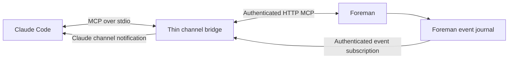

# Step 2: Claude channel integration

Status: planned. Depends on [step 1](01-generic-mcp.md).
[Overview](README.md) · [Next](03-custom-adapters.md)

## Outcome

Full Claude Code support on explicitly tested surfaces: a user opens their authenticated
Claude session, invokes `/agentcraft`, and receives subsequent game work automatically.
AgentCraft does not launch SDK-backed model turns or consume the user's login itself.
This step must be usable before steps 3–5 exist.

## Why a channel adapter exists

Claude can call the shared HTTP MCP endpoint directly. However, Claude Code's documented
push-channel extension currently uses stdio: Claude Code starts the channel subprocess,
which emits `notifications/claude/channel` events. A shared HTTP MCP connection alone
does not register that wake-up path. Channels are a preview feature with explicit opt-in.
[Official channel reference](https://code.claude.com/docs/en/channels-reference)

The bridge is a transport adapter, not another Foreman. Use the same tool definitions and
handlers as step 1. Do not copy tools into a separate bundled source tree as ClaudeCraft does.

## Connection arrangement



In channel mode, configure one AgentCraft MCP entry in Claude: the stdio bridge. It proxies
the generic tools to Foreman using an ordinary MCP client and preserves one connection/job
binding. Do not register duplicate HTTP and stdio copies of all AgentCraft tools. Direct
HTTP remains available as a manual/waiting fallback if channels are unavailable.

The stdio server declares `capabilities.experimental["claude/channel"] = {}` alongside
its tool capability and supplies short server instructions. Notification `content` is the
wake hint; metadata carries event ID and binding generation in the format required by the
tested Claude version. Register before announcing the adapter ready, and keep stdout
reserved for MCP transport messages.

The bridge subscribes to an authenticated Foreman event feed with cursor replay. It emits
only relevant wake hints for its attached binding. It does not consume or mark user/job
messages read merely by delivering a channel event.

## Setup before the executable exists

Provide a repository script that prints or installs the AgentCraft MCP entry and skill,
with a check-only mode and an explicit target scope. It merges configuration and refuses
to overwrite unrelated keys or user-written instruction files. A project install may
write `.mcp.json` and `.claude/skills/agentcraft/SKILL.md` in the selected workspace.

Document the current preview startup form:

```sh
claude --dangerously-load-development-channels server:agentcraft
```

Verify the installed Claude version, channel registration, negotiated MCP revision, and
organization policy. Report unsupported/blocked channels before accepting automatic
wake mode. A slash command cannot enable a required startup flag after the session started.
Do not bypass the channel consent dialog or organization restrictions.

## `/agentcraft` workflow

Install a user-invoked skill with `name: agentcraft` and
`disable-model-invocation: true`. Keep the user's current conversation rather than silently
forking it. The skill connects to the selected environment, calls `attach_session`, and
loads the authoritative bootstrap context. [Claude skills](https://code.claude.com/docs/en/skills)

Instructions cover:

1. Session/profile selection and the granted lead/worker roles.
2. Job claim, role/worktree restrictions, MCP repository tools, and milestone reporting.
3. Explicit `finish_job`, in-game question/permission tickets, and user-only merge approval.
4. Channel events as wake hints: read the queue, deduplicate, and claim before acting.
5. Resume, pause, cancellation, lease loss, and clean detach.

Use the shared instructions resource for changing task state and current role. Keep the
static skill short. Recover the current protocol/role context after compaction or reconnect.
Return user-facing messages with the existing `send_message` tool; `finish_job` is the turn
completion marker. Do not invent a second Claude-only `reply` completion protocol.

## Wake delivery and permissions

Serialize delivery per conversation and coalesce repeated work-available hints. Include
event ID, binding generation, and an instruction to inspect AgentCraft, not credentials or
full repository text. Claiming the same job twice must fail even if a notification repeats.
An acknowledgement of delivery is not an acknowledgement of job completion.

On channel/HTTP disconnect, retain journal position, revoke leases according to the shared
recovery rules, and show "Claude disconnected". Reconnection never silently substitutes
an SDK/API-backed engine. Closing Foreman stops its owned operations, not the user's Claude
terminal. Closing Claude stops its bridge, not the environment.

Use supported per-session tool restrictions or hooks to guide AgentCraft work through MCP.
Do not globally disable tools in the user's other projects. Test the restrictions actually
installed and report their limits. Claude channel permission relay is optional: core
AgentCraft operations already use Foreman's in-game decisions. Never grant blanket
permission bypass to achieve channel support.

## Implementation locations

- Add a channel bridge entry point and setup/diagnostic script under a dedicated integration
  directory, initially callable with the existing Node/TypeScript tooling.
- Reuse `foreman/src/mcp/` registration and `sessions/` job/event services.
- Add the shared bootstrap template and a Claude skill wrapper under integration assets.
- Add bridge integration tests, including an MCP client/server pair with event replay.
- Keep the built-in Claude adapter small enough to migrate into step 3's adapter contract
  without changing any public MCP tool.

## Acceptance and support boundary

- Starting Claude with the documented channel setup and running `/agentcraft` attaches to
  the intended profile. No AgentCraft API key or SDK model process is involved.
- After Claude finishes a turn, an in-game goal wakes the same conversation. It plans,
  performs worker jobs sequentially or coordinates separately attached workers, asks an
  in-game question, edits/tests, and requests review. The user approves the merge.
- Duplicate wake-ups, channel disconnect, Foreman restart, busy-session steering, and stop
  during a command produce no duplicate work or stale writes.
- Direct HTTP/manual mode remains usable when channels are blocked, with its limitations
  shown clearly. That fallback is not advertised as full automatic channel support.
- Publish tested Claude versions and operating systems. Test Claude Code terminal first.
  Validate Claude Code's desktop surface separately; ordinary Claude Desktop chat is a
  separate product surface. If the desktop surface cannot register this channel, document
  that limitation instead of inferring support from HTTP MCP connectivity.
