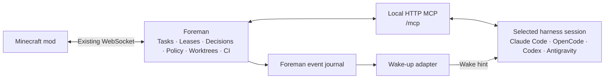

# AgentCraft MCP and user-owned sessions

Status: implementation plan, not implemented. Written 2026-10-09.

## Goal

Let a user launch the AgentCraft environment, connect an already authenticated coding
harness, and invoke AgentCraft instructions inside that session. Foreman continues to own
the studio, task graph, worktrees, policy, decisions, CI, reviews, and persistence. The
user's harness owns model authentication, inference, and conversation context. AgentCraft
does not require a provider API key in this mode.

The shared interface is a local Streamable HTTP MCP server. All harnesses use the same
tools and job protocol. Harness-specific adapters deliver wake-up messages when a session
is idle; they do not implement a second scheduler or a second set of tools.

## Ordered delivery

| Step | Document | Result |
| --- | --- | --- |
| 1 | [Generic MCP](01-generic-mcp.md) | Harness-neutral server, external jobs, and repository tools; usable through manual invocation and bounded waiting |
| 2 | [Claude channel integration](02-claude-channel.md) | Full Claude Code support, including automatic wake-up and `/agentcraft` |
| 3 | [User-custom adapters](03-custom-adapters.md) | Versioned TypeScript adapter API; Claude integration uses the same contract |
| 4 | [AgentCraft executable](04-executable.md) | Cross-platform `agentcraft` command to launch Minecraft and Foreman and configure connections |
| 5 | [Full OpenCode support](05-opencode.md) | Existing OpenCode sessions receive work through their session API |
| 6 | [Full Codex support](06-codex.md) | A user-visible Codex session shares a reachable app-server with the adapter |
| 7 | [Full Antigravity support](07-antigravity.md) | Antigravity 2.0 sidecar wakes the selected conversation |

Implement in this order. Step 2 must work without waiting for the custom adapter framework
or executable. Later steps reuse the tools, job protocol, and lifecycle established first.

## Current code and reuse points

These are observations of the checkout, not proposed interfaces:

- `foreman/src/foreman.ts`: transport-neutral state owner and user-intent handling.
- `foreman/src/server.ts`: existing loopback WebSocket server for the mod.
- `foreman/src/agents/team.ts`: shared scheduling, worktrees, CI, review, and recovery.
- `foreman/src/agents/engine.ts`: `Engine.runTurn(TurnSpec)` isolates model execution.
- `foreman/src/agents/tools.ts`: nine shared coordination tools, with role checks and
  callbacks into team scheduling. Claude wraps these with an SDK MCP server; Codex uses
  app-server dynamic tools.
- `foreman/src/agents/claude/engine.ts`: Foreman starts Claude SDK/CLI turns, injects
  instructions, gates native tools, and maps stream events to the studio.
- `foreman/src/agents/codex/engine.ts` and `rpc.ts`: Foreman starts private app-server
  processes. The current RPC client is a spawning stdio client, not an attachment client.
- `foreman/src/policy.ts`, `gitsafety.ts`, `repos.ts`, and `util/proc.ts`: reuse policy,
  worktree, git environment, and process management primitives.
- `foreman/src/store.ts`, `runfile.ts`, and `protocol.ts`: persistence, profile discovery,
  and the schemas rendered by the mod.
- `tools/unix.mjs` and `tools/launch.ps1`: existing development launchers to extract rather
  than replace with an unrelated launcher.

Existing `--use-claude-login` and Codex login support change authentication for managed
agents. They do not attach the user's interactive session. Preserve those managed engines
and the simulator while introducing the new session execution mode.

## Architecture

Keep the existing game WebSocket and DevBridge. Start MCP on a separate configurable
loopback port initially, recorded in profile discovery metadata. This avoids changing
existing WebSocket upgrade behavior. The MCP service runs in the Foreman process and
calls its services directly; it does not impersonate the game client over WebSocket.

The MCP endpoint and wake-up transport are different responsibilities. Standard MCP
tools do not by themselves start a new model turn. While a workflow is active, a bounded
`wait_for_work` tool can wait for jobs. After a turn ends, an adapter must deliver a new
prompt through a harness-supported channel or session API.

## Shared decisions

### Execution mode, harness, and agent identity

Model these separately: execution mode (`managed`, `session`, or simulator), harness
(`claude`, `opencode`, `codex`, `antigravity`, or custom), and studio agent (`marlow`,
`juniper`, etc.). Do not expand the current two-engine union into a list of transport
behaviors. Migrate existing configuration and persisted records without losing sessions.

One ordinary session has capacity for one job at a time, even if it drives multiple studio
characters sequentially. Multiple attached sessions enable real parallel execution.
Native harness subagents can later become separate registered connections; they must
claim ordinary Foreman jobs. Do not pretend a single conversation provides independent
parallel workers or independent reviewer context.

### Foreman remains authoritative

- Foreman creates worktrees, checks dependencies, runs CI, and applies user-approved merges.
- Models can request a merge but cannot approve their own merge or permission decision.
- `finish_job` ends an agent turn; it does not directly declare the task merged or the goal done.
- Session disconnects retain work, questions, and decision answers for recovery.
- Explicit pause/stop/cancel revokes the current lease and stops Foreman-owned operations.
- Closing Minecraft leaves Foreman and connected harnesses able to continue. Closing the
  harness suspends its execution capacity; it does not silently launch API-backed workers.

### Repository actions and observable behavior

Session mode exposes file, search, edit, command, output, and diff tools through MCP. Those
operations run under Foreman's existing policy and git environment and produce studio
logs. An attached session's native filesystem and shell tools do not automatically pass
through AgentCraft policy. Instructions tell the agent to use MCP for AgentCraft work;
use supported harness restrictions where available and report their actual coverage.

Do not describe an instruction file as an OS sandbox. Existing policy and git protections
also do not create a complete OS sandbox. A stronger sandbox is a separate capability.
Monitors show actual MCP actions and reported milestones, not fabricated token streams or
private reasoning. Unknown usage, model identity, and cost remain unknown.

### Durable jobs and event delivery

Use explicit connection, binding, job, lease generation, operation, and event IDs. Persist
job transitions and event cursors. Claims are atomic, write calls are fenced by their lease,
and retried mutations use idempotency keys. Wake-ups are hints to read the authoritative
queue; they never confer permission to execute a job.

Use at-least-once wake delivery with deduplication. If a provider does not offer delivery
idempotency, do not claim exactly-once behavior: reconcile uncertain delivery and ensure
duplicate prompts cannot claim or finish a job twice. Revalidate all bindings after restart.

## Meaning of full support

A supported harness must complete this without an AgentCraft provider key:

1. Launch the environment and connect the user's authenticated session.
2. Invoke the harness-native AgentCraft command or skill and select the environment.
3. Receive a new game goal while idle and claim its job.
4. Plan, edit in task worktrees, run tests, coordinate, and answer questions through the studio.
5. Return work for review and merge only after the user's approval.
6. Recover from harness disconnect and Foreman restart without duplicate execution.
7. Respect pause/stop/cancel and reject stale operations.

Publish a tested version/platform/surface matrix for each integration. Terminal and desktop
surfaces are separate entries; do not infer that a documented CLI API controls every desktop
installation. Unsupported surfaces get an explicit fallback, not a full-support badge.

## Validation strategy

Run `npm run check` in `foreman/` after implementation changes. Extend schema examples and
generated protocol documentation when the game protocol changes, mirror changes in the
Java mod, and build the mod when its code changes. Add focused tests for leases, recovery,
role restrictions, command cancellation, event replay, and adapter behavior. Keep managed
Claude/Codex and simulator regression coverage.

For each harness, run a real small repository goal with idle wake-up, an in-game question,
an edit, tests, a review, and a user-approved merge. Repeat with a disconnect, restart, and
cancellation. Unit fakes do not establish real client compatibility.

## Documentation baseline and compatibility risks

Official documentation checked during planning on 2026-10-09:

- [Claude MCP](https://code.claude.com/docs/en/mcp),
  [skills](https://code.claude.com/docs/en/skills), and
  [channels reference](https://code.claude.com/docs/en/channels-reference): shared tools
  can use HTTP; the channel extension currently requires stdio and preview opt-in.
- [OpenCode server](https://opencode.ai/docs/server/),
  [MCP](https://opencode.ai/docs/mcp-servers/), and
  [commands](https://opencode.ai/docs/commands/): existing server sessions can receive prompts.
- [Codex app-server](https://developers.openai.com/codex/app-server/),
  [MCP](https://developers.openai.com/codex/mcp/), and
  [skills](https://developers.openai.com/codex/skills/): app-server starts turns; shared terminal
  attachment is documented, while WebSocket transport is experimental.
- [Antigravity MCP](https://antigravity.google/docs/mcp) and
  [sidecars](https://www.antigravity.google/docs/sidecars/): Antigravity 2.0 sidecars can send
  messages to existing conversations.

Recheck these contracts against the versions used for implementation. All new commands,
configuration fields, TypeScript interfaces, and file layouts below are proposed APIs.
